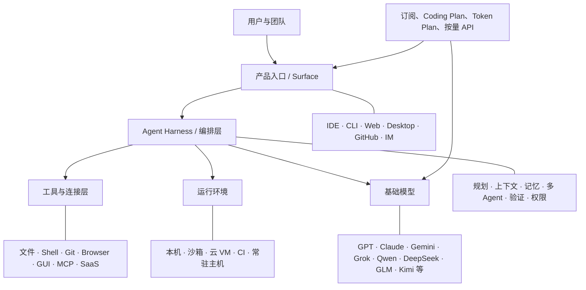

# AI Agent Landscape

> AI Agent 产品、运行形态、模型与用量方案的中文生态地图

AI Agent 已经不再只是聊天框或代码补全插件。一个完整的 Agent 产品，通常由模型、上下文工程、工具、执行环境、权限系统和交付界面共同组成，可以理解需求、拆解任务、调用工具、修改文件、运行代码，并在一定程度上持续工作直至交付结果。

本仓库提供一份面向中文读者的公开生态索引，重点梳理 AI 编程、知识工作、桌面操作、浏览器操作、常驻个人 Agent，以及与其配套的 Coding Plan、Token Plan、API Router、基础模型和 Chat 产品。

> [!IMPORTANT]
> 这是一张“地图”，不是排行榜。产品能力、价格、额度、地区可用性和名称都在快速变化；选型前请以链接中的官方页面为准。

## 目录

- [如何理解这张地图](#如何理解这张地图)
- [分层架构](#分层架构)
- [AI IDE / Agent IDE](#ai-ide--agent-ide)
- [CLI / Terminal Coding Agent](#cli--terminal-coding-agent)
- [Cloud / Background Coding Agent](#cloud--background-coding-agent)
- [GitHub / Repository-native Agent](#github--repository-native-agent)
- [通用 Work / Desktop Agent](#通用-work--desktop-agent)
- [Personal / Always-on Agent](#personal--always-on-agent)
- [Computer-Use / Browser-Use Agent](#computer-use--browser-use-agent)
- [Coding Plan / Token Plan](#coding-plan--token-plan)
- [API Router / 聚合平台](#api-router--聚合平台)
- [基础模型 / Chat 产品](#基础模型--chat-产品)
- [选型速查](#选型速查)
- [维护与贡献](#维护与贡献)
- [信息时效与声明](#信息时效与声明)

## 如何理解这张地图

### 分类标准

本项目使用四个互相独立的维度，而不是给产品贴一个永久标签：

| 维度                          | 主要问题                         | 常见取值                                                            |
| ----------------------------- | -------------------------------- | ------------------------------------------------------------------- |
| 交&#8288;互&#8288;入&#8288;口 | 用户在哪里指挥 Agent？           | IDE、终端、网页、桌面应用、GitHub、聊天工具                         |
| 执&#8288;行&#8288;位&#8288;置 | 任务在哪里运行？                 | 本机、隔离沙箱、云端 VM、CI / GitHub Actions、移动设备              |
| 工&#8288;作&#8288;对&#8288;象 | Agent 主要操作什么？             | 代码仓库、网页、桌面 GUI、本地文件、文档、表格、演示稿、第三方 SaaS |
| 自&#8288;治&#8288;方&#8288;式 | Agent 能持续工作多久、如何交付？ | 同步协作、后台异步、定时任务、常驻服务、PR / 文件 / 报告交付        |

### 为什么产品会跨类

同一个品牌可能同时提供模型、聊天产品和多个 Agent 入口。例如：

- OpenAI：ChatGPT、Codex 本地客户端/CLI、云端 Coding Agent 与 API；
- Anthropic：Claude Chat、Claude Code、Claude Cowork 与 Claude API；
- Qoder：Qoder Desktop、Qoder CLI、Cloud Agents、QoderWork 与 QoderWake；
- TRAE：TRAE IDE、SOLO 和面向通用工作的 TRAE Work；
- 腾讯：混元模型、CodeBuddy、WorkBuddy 与腾讯云 Token Plan。

因此，表格中的“代表形态”表示当前最典型的入口，并不排除产品还具有其他形态。

## 分层架构

可以用一句话区分几个常被混用的概念：

- **Model（模型）**负责理解和生成；
- **Harness（Agent 运行框架）**负责准备上下文、循环调用模型与工具、处理权限并验证结果；
- **Surface（产品入口）**是 IDE、CLI、网页或桌面应用；
- **Plan / API**决定如何获得模型或产品的使用额度。

## AI IDE / Agent IDE

这类产品以代码编辑器为主界面，通常把代码库索引、补全、对话、文件编辑、终端、调试和 Agent 模式整合在一起。

| 产品                                                  | 团队 / 地区      | 代表能力                                         | 其他形态                         |
| ----------------------------------------------------- | ---------------- | ------------------------------------------------ | -------------------------------- |
| [Cursor](https://www.cursor.com/)                     | Anysphere / 美国 | AI 原生编辑器、Agent、代码库理解                 | Background Agents、CLI           |
| [Windsurf](https://windsurf.com/)                     | Windsurf / 美国  | Agentic IDE、编辑器内多步开发                    | 插件、企业能力                   |
| [Kiro](https://kiro.dev/)                             | AWS / 美国       | 规格驱动开发、Agent hooks                        | CLI                              |
| [Google Antigravity](https://antigravity.google/)     | Google / 美国    | Agent-first 开发平台、多本地 Agent、浏览器与终端 | CLI、API Agent                   |
| [GitHub Copilot](https://github.com/features/copilot) | GitHub / 美国    | IDE Agent、Plan、补全与多模型                    | CLI、Coding Agent、GitHub Agents |
| [Qoder](https://qoder.com/)                           | 阿里巴巴 / 中国  | 自主开发桌面、代码库理解、任务委派               | CLI、Cloud Agents、Work、Wake    |
| [TRAE IDE](https://www.trae.ai/)                      | 字节跳动 / 中国  | IDE 与 SOLO 协同、端到端软件构建                 | TRAE Work、SOLO Web/Mobile       |
| [CodeBuddy IDE](https://www.codebuddy.ai/)            | 腾讯 / 中国      | 需求、设计、编码、预览到部署；Agent/Plan 模式    | CLI、Work 模式                   |
| [ZCode](https://zcode.z.ai/)                          | 智谱 / 中国      | 面向 GLM 的 Agent IDE、Goal 长任务               | GLM Coding Plan                  |
| [文心快码 Comate](https://comate.baidu.com/)          | 百度 / 中国      | 独立 AI IDE、Zulu 编程智能体                     | VS Code / JetBrains 插件         |

## CLI / Terminal Coding Agent

终端 Agent 直接工作在仓库和工具链旁，适合开发者、服务器环境、自动化脚本与可组合工作流。

| 产品                                                                                 | 开发者           | 定位与备注                                                             |
| ------------------------------------------------------------------------------------ | ---------------- | ---------------------------------------------------------------------- |
| [Codex CLI](https://github.com/openai/codex)                                         | OpenAI           | 开源终端编程 Agent；可读写文件、运行命令并连接 Codex 生态              |
| [Claude Code](https://docs.anthropic.com/en/docs/claude-code/overview)               | Anthropic        | 终端优先的 Agentic Coding 工具，支持 hooks、skills、MCP 与多 Agent     |
| [Gemini CLI](https://github.com/google-gemini/gemini-cli)                            | Google           | 开源终端 Agent，与 Gemini 模型和 Google 开发生态结合                   |
| [Grok Build](https://docs.x.ai/build/overview)                                       | xAI              | 可交互或无头运行的开源 Coding Agent / TUI，支持 ACP                    |
| [Muse Code](https://research.meta.ai/blog/introducing-muse-code-and-muse-spark-1-2/) | Meta             | 面向 Muse Spark 的终端编程 Agent；新产品，文档与可用范围仍可能快速调整 |
| [Qwen Code](https://qwenlm.github.io/qwen-code-docs/)                                | 阿里巴巴         | 开源终端 Agent，针对 Qwen Coder 优化，也支持多模型提供方               |
| [Qoder CLI](https://docs.qoder.com/cli/quick-start)                                  | 阿里巴巴         | 终端原生编程伙伴及可扩展 Agent 引擎                                    |
| [CodeBuddy Code](https://www.codebuddy.ai/docs/cli/)                                 | 腾讯             | CLI Agent，支持 IDE 集成、ACP、MCP 与自动化模式                        |
| [MUSACode](https://docs.mthreads.com/playbook/playbook-doc-online/musacode/)         | 摩尔线程         | 终端 Coding Agent，兼顾通用开发和 MUSA 算子工作流                      |
| [OpenCode](https://opencode.ai/)                                                     | 开源社区         | 开源、多模型的终端/桌面 Coding Agent                                   |
| [OpenHands](https://www.openhands.dev/)                                              | OpenHands / 开源 | 可本地运行或云端部署的软件工程 Agent 平台与 SDK                        |

### 关于“DeepSeek Harness”

截至本版核验日期，DeepSeek 官方提供的是模型、API，以及将模型接入 [Claude Code、OpenCode、OpenClaw 等工具的指南](https://api-docs.deepseek.com/guides/coding_agents)。因此更准确的写法是 **DeepSeek + 第三方 Agent Harness**，不应把它描述成已经独立发布的“DeepSeek Harness”产品。若未来出现官方独立 Harness，本仓库会单独收录。

## Cloud / Background Coding Agent

这类 Agent 在远程沙箱或云 VM 中异步执行任务。用户可以离开当前页面，稍后回来审查 diff、提交或 PR。

| 产品                                                                                                              | 典型执行方式                       | 主要交付物                   |
| ----------------------------------------------------------------------------------------------------------------- | ---------------------------------- | ---------------------------- |
| [OpenAI Codex](https://openai.com/codex/)                                                                         | 本地与云端任务并存，可连接代码仓库 | 代码变更、检查结果、PR       |
| [Cursor Background Agents](https://docs.cursor.com/background-agents)                                             | 云端隔离环境异步工作               | 分支、diff、PR               |
| [Devin](https://devin.ai/)                                                                                        | 云端软件工程 Agent                 | 实现、测试、PR、任务记录     |
| [Jules](https://jules.google/)                                                                                    | 克隆仓库到云 VM，计划并验证        | 分支、diff、PR               |
| [GitHub Copilot coding agent](https://docs.github.com/en/copilot/concepts/agents/coding-agent/about-coding-agent) | GitHub Actions 驱动的异步 Agent    | Pull request                 |
| [OpenHands Cloud](https://www.openhands.dev/)                                                                     | 托管沙箱或自建运行时               | 代码变更、PR、批量工程任务   |
| [Qoder Cloud Agents](https://qoder.com/)                                                                          | Qoder 平台中的云端 Agent           | 后台开发任务与可审查结果     |
| [TRAE Work / SOLO Web](https://www.trae.ai/work)                                                                  | 云端工作区、多任务并行             | 代码、应用、文档和结构化成果 |

## GitHub / Repository-native Agent

Repository-native Agent 以 Issue、Pull Request、Review、Actions 或仓库标签为任务入口，天然适合异步委派和团队审查。

| 产品                                                                  | 原生入口                            | 工作闭环                             |
| --------------------------------------------------------------------- | ----------------------------------- | ------------------------------------ |
| [GitHub Copilot coding agent](https://github.com/features/ai)         | GitHub Issue、Agents、VS Code       | Issue → 分支 → Actions → PR → Review |
| [OpenAI Codex](https://openai.com/codex/)                             | GitHub 连接与云任务                 | 仓库任务 → 沙箱执行 → Review / PR    |
| [Jules](https://jules.google/)                                        | GitHub 仓库、Issue 标签、API        | 仓库/Issue → 云 VM → PR              |
| [Devin](https://devin.ai/)                                            | GitHub / 工单集成                   | 任务 → 实现与测试 → PR               |
| [OpenHands](https://www.openhands.dev/)                               | GitHub Actions、Issue/PR 与平台任务 | 任务 → 沙箱或自托管执行 → PR         |
| [Cursor Background Agents](https://docs.cursor.com/background-agents) | 编辑器、Web/Mobile 与仓库           | 后台任务 → 分支 → PR                 |

“在 IDE 里知道当前 Git 仓库”并不自动等于 Repository-native；本分类更强调 Agent 是否把 Issue / PR / Review 当作一等工作对象。

## 通用 Work / Desktop Agent

Work Agent 的核心不是“什么都能聊”，而是能够处理文件、网页、数据和办公成果，并以文档、表格、演示稿、网页或已完成操作交付。

| 产品                                                                                      | 团队 / 地区      | 本地与执行特点                                                 | 典型成果                                |
| ----------------------------------------------------------------------------------------- | ---------------- | -------------------------------------------------------------- | --------------------------------------- |
| [WorkBuddy](https://cloud.tencent.cn/product/workbuddy)                                   | 腾讯 / 中国      | 全场景 AI 工作台；覆盖办公、代码与设计，支持本地文件和工具执行 | 文档、数据分析、周报、应用与设计成果    |
| [QoderWork](https://docs.qoder.com/zh/qoderwork/introduction)                             | 阿里巴巴 / 中国  | 本地优先桌面助手；文件、浏览器、Computer Use 与定时任务        | 文档、表格、演示稿、数据和网页流程      |
| [TRAE Work](https://www.trae.ai/work)                                                     | 字节跳动 / 中国  | Desktop / Web / Mobile；Work 与 Code 双模式，云端并行执行      | 研究、文档、数据分析、PPT、代码与应用   |
| [Kimi Work](https://www.kimi.com/products/kimi-work)                                      | 月之暗面 / 中国  | 本地文件、WebBridge、代码执行、Goal 与定时任务                 | 报告、表格、演示稿、代码和网页任务      |
| [CodeBuddy Agents](https://www.codebuddy.ai/docs/cn/ide/User-guide/Agent-Mode/Quickstart) | 腾讯 / 中国      | IDE 内提供编程与通用工作模式、多任务管理                       | README、研究、报告、PPT、数据分析与代码 |
| [AutoClaw](https://autoclaw.zhipuai.cn/)                                                  | 智谱 / 中国      | 基于 OpenClaw 的本地 AI 数字员工，Skills、IM 和浏览器能力      | 研究、文档、内容、自动化与长任务        |
| [Claude Cowork](https://claude.com/product/cowork)                                        | Anthropic / 美国 | 桌面工作区、受控本地文件与连接器，多步骤知识工作               | 文档、数据、跨应用工作成果              |
| [ChatGPT agent](https://openai.com/index/introducing-chatgpt-agent/)                      | OpenAI / 美国    | 云端虚拟计算机、浏览器、代码与连接器                           | 研究、表格、演示稿与网页操作            |
| [Manus](https://manus.im/)                                                                | Manus            | 云端通用 Agent，并提供桌面/本机协作形态                        | 研究、网站、数据与多格式成果            |

## Personal / Always-on Agent

常驻 Agent 强调持续可达、定时或事件触发、长期状态，以及从聊天工具或移动端远程下达任务。它与一次性桌面 Agent 的边界正在快速融合。

| 产品                                                    | 常驻方式                                   | 适合场景                             |
| ------------------------------------------------------- | ------------------------------------------ | ------------------------------------ |
| [OpenClaw](https://openclaw.ai/)                        | 自托管个人 Agent，可连接消息渠道和 Skills  | 私有化、可扩展的个人自动化           |
| [AutoClaw](https://autoclaw.zhipuai.cn/)                | 一键本地部署、IM 接入、Skills 与浏览器能力 | 降低 OpenClaw 部署门槛、个人数字员工 |
| [QoderWake](https://qoder.com/)                         | 面向 7×24 工作的桌面/服务器 Agent          | 持续目标、远程管理和组织级数字员工   |
| [Kimi Work](https://www.kimi.com/products/kimi-work)    | Scheduled Tasks、Goal Mode、本地后台执行   | 定时报表、监控、长周期文件与研究任务 |
| [WorkBuddy](https://cloud.tencent.cn/product/workbuddy) | 工作台、Skills 与企业工作连接              | 团队办公自动化和可复用工作流         |

是否“永远在线”取决于设备电源、后台权限、云服务状态、套餐限额和具体版本，不能只根据营销名称判断。

## Computer-Use / Browser-Use Agent

Browser-use 通常通过 DOM、无障碍树、截图或浏览器扩展操作网页；Computer-use 则进一步覆盖桌面 GUI。两者都应重点关注确认机制、权限边界和提示注入风险。

| 产品 / 能力                                                           | 主要环境                 | 能力边界                                             |
| --------------------------------------------------------------------- | ------------------------ | ---------------------------------------------------- |
| [AutoGLM](https://autoglm.z.ai/)                                      | 手机、云手机与设备 Agent | 视觉理解、点击、滑动、输入和跨 App 任务              |
| [QoderWork](https://docs.qoder.com/qoderwork/introduction)            | 浏览器与桌面应用         | 网页导航、填表、数据提取及桌面点击/输入/滚动         |
| [Kimi WebBridge](https://www.kimi.com/products/kimi-work)             | 浏览器                   | 多标签页浏览、点击、滚动、提取和表单任务             |
| [WorkBuddy](https://cloud.tencent.cn/product/workbuddy)               | 本地工作台与浏览器       | 文件、网页和办公流程执行                             |
| [ChatGPT agent](https://openai.com/index/introducing-chatgpt-agent/)  | 云端虚拟计算机           | 浏览器操作、研究、代码执行和连接器；高影响操作需确认 |
| [Claude Cowork / Claude in Chrome](https://claude.com/product/cowork) | 桌面工作区与浏览器       | 文件、连接器和浏览器协作，强调隔离与权限控制         |
| [Google Antigravity](https://antigravity.google/)                     | 开发工作区与浏览器       | 以开发任务为中心的浏览器测试和工具操作               |

使用这类产品时，建议默认遵循最小权限：限定工作目录、使用专门账号、敏感操作保留人工确认，不在未知网页任务中暴露密钥或高权限会话。

## Coding Plan / Token Plan

### 先区分四种付费方式

| 类型         | 买到的是什么                                            | 常见限制                                   | 例子                                              |
| ------------ | ------------------------------------------------------- | ------------------------------------------ | ------------------------------------------------- |
| 产品席位订阅 | 某个 App / IDE / Agent 的使用权                         | 请求数、Agent 次数、并发和高级模型         | ChatGPT、Claude、Cursor、Windsurf、GitHub Copilot |
| Coding Plan  | 指定编程工具可用的固定月费模型额度                      | 工具白名单、滚动窗口、模型白名单、公平使用 | GLM Coding Plan、阿里云 Coding Plan               |
| Token Plan   | 面向 Coding / OpenClaw 等 Agent 的打包 Token 或请求额度 | 专用 Key / Endpoint、场景限制、调度优先级  | 腾讯云 Token Plan、QwenCloud Token Plan           |
| 按量 API     | 按实际输入/输出/缓存/工具用量计费                       | 账户余额、速率限制、区域和模型可用性       | OpenAI API、Anthropic API、DeepSeek API 等        |

> [!WARNING]
> 产品会员通常不等于 API 额度；Coding Plan 的 Key 也通常不是无限制的通用 API Key。接入前必须核对允许的客户端、端点、模型白名单、上下文上限和公平使用条款。

### 国内代表性方案

| 方案                           | 提供方   | 特点                                                             | 官方信息                                                                                                                          |
| ------------------------------ | -------- | ---------------------------------------------------------------- | --------------------------------------------------------------------------------------------------------------------------------- |
| GLM Coding Plan                | 智谱     | 面向指定 Coding Agent 和工具的固定月费方案，支持 GLM 系列        | [套餐概览](https://docs.bigmodel.cn/cn/coding-plan/overview)                                                                      |
| 阿里云 / QwenCloud Coding Plan | 阿里云   | Qwen 与多款国内模型，专用 Key 和 Endpoint，支持多种 Coding Agent | [中国站文档](https://help.aliyun.com/zh/model-studio/coding-plan) · [国际站文档](https://docs.qwencloud.com/coding-plan/overview) |
| 腾讯云 Token Plan              | 腾讯云   | 面向编程与 OpenClaw 类工具的多模型套餐                           | [产品页](https://cloud.tencent.cn/act/pro/tokenplan)                                                                              |
| Kimi Coding Plan               | 月之暗面 | 面向 Coding Agent 的 Kimi 模型订阅方案                           | [开放平台](https://platform.moonshot.cn/)                                                                                         |
| MiniMax Coding Plan            | MiniMax  | 面向 Coding Agent 的 MiniMax 模型订阅方案                        | [开放平台](https://platform.minimaxi.com/)                                                                                        |
| 火山方舟 Coding Plan           | 火山引擎 | 豆包及多模型接入，面向主流编程工具                               | [方舟平台](https://www.volcengine.com/product/ark)                                                                                |

本仓库刻意不抄录价格和精确额度：促销、模型列表、请求窗口和地区政策变化很快，静态数字容易误导。

## API Router / 聚合平台

API Router 或模型聚合平台提供统一接口、模型目录、账单与路由。它解决“如何接入多个模型”，但不会自动替代 Agent Harness。

| 平台                                                              | 覆盖与特点                                     | 使用前重点检查                                  |
| ----------------------------------------------------------------- | ---------------------------------------------- | ----------------------------------------------- |
| [OpenRouter](https://openrouter.ai/)                              | 全球多模型统一 API、供应商路由、回退、统一账单 | 供应商数据策略、路由规则、加价/手续费、模型别名 |
| [SiliconFlow](https://siliconflow.cn/)                            | 国内外开源与商业模型 API、统一推理平台         | 模型版本、地域、速率、数据与发票政策            |
| [阿里云百炼 Model Studio](https://www.aliyun.com/product/bailian) | Qwen 及第三方模型、Agent/应用构建与企业云能力  | 地域端点、产品线 Key、模型白名单                |
| [火山引擎方舟](https://www.volcengine.com/product/ark)            | 豆包与多模型服务、推理和 Agent 工具链          | Endpoint 配置、上下文、并发与套餐边界           |
| [腾讯云 TokenHub](https://cloud.tencent.cn/product/tokenhub)      | 多模型 Token 与 Agent 工具适配                 | Coding/通用套餐差异、工具适配与公平调度         |
| [百度智能云千帆](https://cloud.baidu.com/product/wenxinworkshop)  | 文心及多模型平台、应用与 Agent 开发            | 区域、模型映射、配额和兼容接口差异              |
| [ModelScope 魔搭](https://modelscope.cn/)                         | 模型社区、推理与开发生态                       | 社区模型许可、托管服务限制和生产 SLA            |

选择聚合平台时，不要只比较每百万 Token 单价。还应比较缓存计费、失败重试、上下文裁剪、工具调用、速率、可观测性、数据保留、模型是否被静默替换，以及直接供应商不可用时的回退策略。

## 基础模型 / Chat 产品

Chat 产品、基础模型和 Agent 产品是三个不同层次。Chat 可能内置 Agent；一个 Agent 也可能允许切换多个模型。

| 体系      | 基础模型 / API                                                    | 面向用户的 Chat 或入口                      | 相关 Agent 产品                 |
| --------- | ----------------------------------------------------------------- | ------------------------------------------- | ------------------------------- |
| OpenAI    | [GPT / OpenAI API](https://platform.openai.com/docs/)             | [ChatGPT](https://chatgpt.com/)             | Codex、ChatGPT agent            |
| Anthropic | [Claude API](https://docs.anthropic.com/)                         | [Claude](https://claude.ai/)                | Claude Code、Claude Cowork      |
| Google    | [Gemini API](https://ai.google.dev/)                              | [Gemini](https://gemini.google.com/)        | Antigravity、Gemini CLI、Jules  |
| xAI       | [Grok API](https://docs.x.ai/)                                    | [Grok](https://grok.com/)                   | Grok Build、Build mode          |
| Meta      | [Muse / Meta Model API](https://ai.meta.com/llama/)               | Meta AI 与开发者入口                        | Muse Code                       |
| 月之暗面  | [Kimi API](https://platform.moonshot.cn/)                         | [Kimi](https://www.kimi.com/)               | Kimi Work、Kimi Code            |
| DeepSeek  | [DeepSeek API](https://api-docs.deepseek.com/)                    | [DeepSeek Chat](https://chat.deepseek.com/) | 通过第三方 Harness 使用         |
| 阿里巴巴  | [Qwen API / Model Studio](https://www.aliyun.com/product/bailian) | [Qwen Chat](https://chat.qwen.ai/)          | Qwen Code、Qoder 系列           |
| 智谱      | [GLM API](https://docs.bigmodel.cn/)                              | [智谱清言 / Z.ai](https://chat.z.ai/)       | ZCode、AutoGLM、AutoClaw        |
| 字节跳动  | [豆包大模型 / 方舟](https://www.volcengine.com/product/doubao)    | [豆包](https://www.doubao.com/)             | TRAE 系列                       |
| 腾讯      | [混元](https://cloud.tencent.com/product/hunyuan)                 | [腾讯元宝](https://yuanbao.tencent.com/)    | CodeBuddy、WorkBuddy            |
| MiniMax   | [MiniMax API](https://platform.minimaxi.com/)                     | [MiniMax](https://www.minimaxi.com/)        | Coding Plan 与第三方 Agent 接入 |

上表只表示同一厂商或生态中的主要关系，不表示某个 Agent 永远只使用自家模型。

## 选型速查

| 目标                          | 优先考察的类别                  | 关键问题                                         |
| ----------------------------- | ------------------------------- | ------------------------------------------------ |
| 在当前项目里边看边改          | AI IDE / CLI Agent              | 是否理解大型代码库？能否运行测试？权限是否可控？ |
| 把 Issue 委派出去，回来审 PR  | Cloud / Repository-native Agent | 沙箱隔离、并发、PR 质量、日志与成本              |
| 处理本地文档、表格和 PPT      | Work / Desktop Agent            | 文件格式保真、隐私、可撤销性和交付质量           |
| 自动填写网页或跨应用操作      | Browser / Computer Use          | 确认机制、登录态隔离、失败恢复和提示注入防护     |
| 让个人 Agent 定时或常驻工作   | Personal / Always-on Agent      | 设备在线、远程入口、密钥管理、预算上限和审计     |
| 给多个 Agent 统一购买模型额度 | Coding / Token Plan 或 Router   | 客户端兼容、模型白名单、速率、真实成本和数据策略 |

## 维护与贡献

欢迎通过 Issue 或 Pull Request 提交：

- 新产品或已停止服务的产品；
- 官方名称、链接、产品归属或分类修正；
- 官方宣布的能力、地区、平台或套餐变化；
- 可复现的能力边界和安全注意事项。

提交更新时，请尽量提供官方产品页、官方文档、发布公告或官方开源仓库。二手评测可以作为补充，但不应成为“产品存在”或“官方能力”的唯一依据。价格类更新请同时注明地区、币种、税费、日期和套餐条件。

版本记录见 [CHANGELOG.md](CHANGELOG.md)。

## 信息时效与声明

- 当前版本：**v0.1.0**
- 最近系统核验：**2026-08-15**
- 本仓库是独立的社区整理项目，与文中任何厂商均无隶属、授权、赞助或背书关系。
- 产品名称与商标归各自权利人所有；链接优先指向官方来源。
- “支持”表示官方页面在核验时公开描述该能力，不代表所有地区、账号、系统、套餐或灰度版本都可用。
- 本项目不提供购买建议、收益承诺或对安全性、可用性、合规性的保证。
- 对本地文件、浏览器登录态、代码仓库和第三方账号授予权限前，请自行完成风险评估并保留备份。

## License

[MIT](LICENSE)
